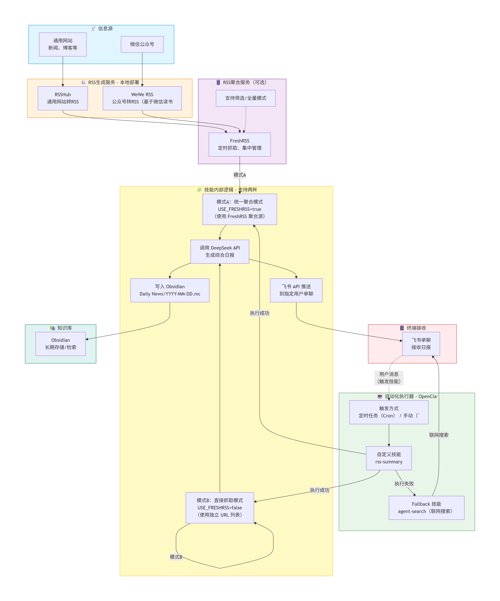

# rss-summary-openclaw · OpenClaw 智能新闻日报技能

[](LICENSE)
[](https://github.com/openclaw-ai/openclaw)

基于 OpenClaw 框架的自定义技能，自动抓取 RSS 源（新闻网站 + 微信公众号），调用 DeepSeek API 生成综合日报，推送到飞书单聊，并归档到 Obsidian。

---

## ✨ 核心特性

- **两种工作模式**：
  - **模式A（统一聚合）**：通过 FreshRSS 聚合所有源，支持白名单筛选 / 全量模式。
  - **模式B（直接抓取）**：绕过 FreshRSS，直接从预设的 URL 列表抓取 RSS。
- **AI 日报**：调用 DeepSeek 将多篇文章整合为一份日报，包含主题分类、一句话摘要、原文链接、今日重点总结。
- **飞书推送**：通过飞书企业自建应用（长连接）发送到单聊，消息超长自动分批。
- **Obsidian 归档**：每日日报自动追加到 `Daily News/YYYY-MM-DD.md`，便于长期检索。
- **高可靠性**：网络请求超时重试、DeepSeek 失败时降级为原始列表、脚本与 OpenClaw 环境完全兼容。

---

## 🧱 整体架构


> 模式A使用 FreshRSS 聚合源（可开启白名单筛选），模式B直接抓取独立 URL 列表。成功时调用 DeepSeek 生成日报并推送；失败时自动 fallback 到 `agent-search` 联网搜索。

---

## 📂 项目文件结构

```
rss-summary/
├── SKILL.md                 # OpenClaw 技能定义文件
├── fetch_and_push.py        # 主脚本
├── run.sh                   # 包装脚本（确保环境一致）
├── .env.example             # 环境变量模板
├── requirements.txt         # Python 依赖
├── README.md                # 项目说明
├── architecture.png         # 项目整体架构图
└── LICENSE                  # MIT 许可证
```

---

## 🚀 快速开始

### 前置条件

- OpenClaw 已安装并运行（`openclaw gateway status` 应显示 `running`）
- Docker 环境（用于 RSSHub / WeWe RSS / FreshRSS，可选）
- DeepSeek API Key（[注册](https://platform.deepseek.com/)）
- 飞书企业自建应用（已配置**长连接**，开通 `im:message` 权限）
- Obsidian（可选，用于归档）

---

### 安装技能

```bash
git clone https://github.com/Ashley-Linn/rss-summary-openclaw.git ~/.openclaw/skills/rss-summary

cd ~/.openclaw/skills/rss-summary
python3 -m venv .venv
source .venv/bin/activate
pip install -r requirements.txt
cp .env.example .env
nano .env
```

---

### 配置 `.env` 文件（至少填写以下关键项）

```env
# 模式选择（二选一）
USE_FRESHRSS=true
FILTER_MODE=true

# 模式A
FRESHRSS_URL=http://localhost:8080/feeds/你的用户名/你的token?hours=24
FOCUS_FEATURES_JSON=["chinanews.com.cn","qbitai.com","MP_WXS_xxx"]

# 模式B
DIRECT_FEED_URLS_JSON=["https://www.qbitai.com/feed","https://36kr.com/feed"]

# 飞书
FEISHU_APP_ID=cli_xxx
FEISHU_APP_SECRET=xxx
FEISHU_USER_OPEN_ID=ou_xxx

# AI
DEEPSEEK_API_KEY=sk-xxx

# 归档
OBSIDIAN_VAULT_PATH=/mnt/d/MyNotes/Obsidian
MAX_ARTICLES=10
```

---

### 手动测试

```bash
cd ~/.openclaw/skills/rss-summary
source .venv/bin/activate
python fetch_and_push.py
```

---

### 注册为 OpenClaw 技能

```bash
openclaw skills list | grep rss-summary
```

---

### 设置定时任务（每天 07:30）

```bash
openclaw cron add \
  --name "定时RSS汇总" \
  --cron "30 7 * * *" \
  --tz "Asia/Shanghai" \
  --session isolated \
  --message "运行技能 rss-summary" \
  --no-deliver
```

**参数说明：**
- `--name`：任务名称（必填）
- `--cron`：定时表达式（必填）
- `--tz`：时区（推荐）
- `--session isolated`：独立会话
- `--message`：执行指令
- `--no-deliver`：静默执行

---

## ❓ 常见问题

### 1. 手动执行成功，但 OpenClaw 调用卡住？
**原因**：工作目录、环境变量、输出缓冲不一致。
**解决**：使用 `run.sh` 启动，确保脚本内使用绝对路径加载 `.env`。

### 2. 飞书无响应，报错 `ECONNREFUSED 127.0.0.1:7897`？
**原因**：WSL 代理环境变量残留。
**解决**：清理 `~/.bashrc` 内代理配置，重启 WSL。

### 3. FreshRSS 筛选失效？
**原因**：RSS 条目缺少 `<source>` 字段。
**解决**：脚本已自动使用域名匹配，无需额外处理。

---

## 🤝 贡献与许可

本项目采用 **MIT 许可证**，欢迎提交 Issue 和 PR。

---

## 🔗 相关链接

- [OpenClaw 官方文档](https://openclaw.ai/)
- [RSSHub](https://docs.rsshub.app/)
- [WeWe RSS](https://github.com/cooderl/wewe-rss)
- [DeepSeek](https://platform.deepseek.com/)